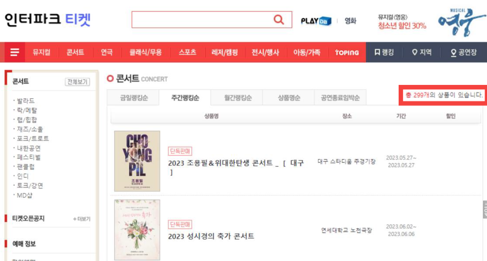
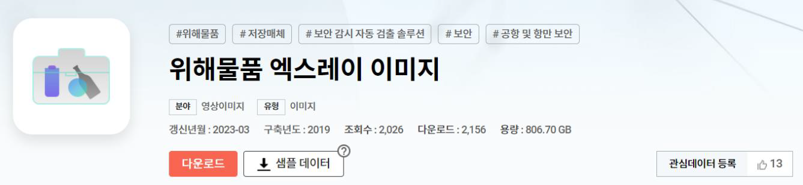

# Project Name : Xray-detection
페스티벌이나 콘서트에서 위험한 물품들을 탐지할 수 있게 엑스레이 이미지에서 칼, 가위 등 위험한 물품을 탐지해주는 프로젝트

## Contents Table
- [프로젝트 상세 내용](#프로젝트-상세-내용)
    - [문제 상황](#문제-상황)
    - [기대효과](#기대효과)
    - [PROJECT 설명](#PROJECT-설명)
    - [활용 Dataset](#활용-Dataset)
- [사용 기술 및 라이브러리](#사용-기술-및-라이브러리)
- [담당한 부분](#담당한-부분) 
- [개발 환경](#Environment)
 

## 📖 프로젝트 상세 내용
### 문제 상황

- 코로나 시대의 거리두기와 마스크 해제로 인해 오프라인 페스티벌 및 콘서트가 많이 개최되고 있다.

- 국내 최대 규모의 티켓 예매 서비스 플랫폼인 '인터파크 티켓'에서 2023.04.18 기준 약 300개의 콘서트 예매가 이루어지고 있으며, 점차 그 수가 늘어날 것으로 예상됨.
- 축제를 진행할 때에는 금지물품을 반입할 수 없게 하나씩 가방 검사를 진행한다.
- 이는 시간과 인력이 필요하며 효율적이지 못하다고 볼 수 있다. 또한, 몰래 눈속임으로 위험 물품을 반입하는 사건을 방지할 수 없다.

#### **엑스레이 이미지를 이용하여 위해 물품을 탐지하는 모델이 필요하다**

### 기대효과 

- 페스티벌이나 콘서트에서 공항의 X-ray 물품검사를 진행하는 것처럼 검사를 자동화할 수 있다.
- 물품을 검사하는데 드는 시간을 단축할 수 있고, 사람들이 안전하게 페스티벌을 즐길 수 있다.
- 축제 뿐만이 아닌 보안을 위한 장소에서도 자동으로 위험한 물품을 탐지하여 사고를 방지할 수 있다.

### PROJECT 설명 
- YOLOv4 모델을 Darknet을 이용하여 학습시켰고, 엑스레이 이미지를 입력하면 학습시킬 때 선정한 12가지의 물품을 탐지하여 위치와 라벨이 결과로 도출되는 프로젝트

### 활용 Dataset

AIHub - [위해물품 엑스레이 이미지](https://aihub.or.kr/aihubdata/data/view.do?currMenu=&topMenu=&aihubDataSe=realm&dataSetSn=233)

- 칼, 가위 등 실제 페스테벌에서 위해 물품으로 분류될 12가지의 물품 엑스레이 사진 약 12000장 사용

## 🛠️ 사용 기술 및 라이브러리
- Roboflow
- Numpy, Matplotlib
- YOLOv4, Darknet

## 담당한 부분
- 데이터 라벨링 교정(파이썬 코드 이용)
- 데이터 전처리, Augmentation(증강) 진행
- YOLOv4 모델 학습

## 🗃️ Environment

| Env |CPU | GPU | RAM | OS 
|:--:|:--:|:--:|:--:|:--:|
| Local | i5- 10400F | RTX-3080(12G) | 32G| Window10 |
| AWS |  AMD-EPYC-7R32 | RTX-3090| 12G| Ubuntu |
| Colab + | intel Xeon | A100 | 80G | Ubuntu |
